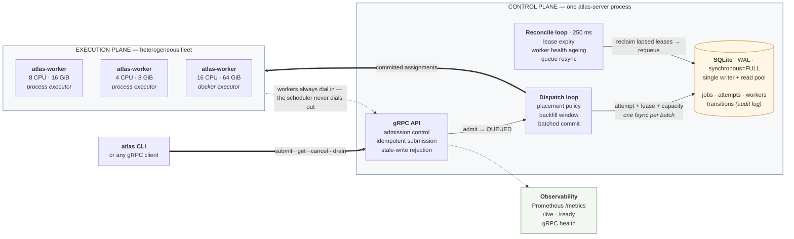
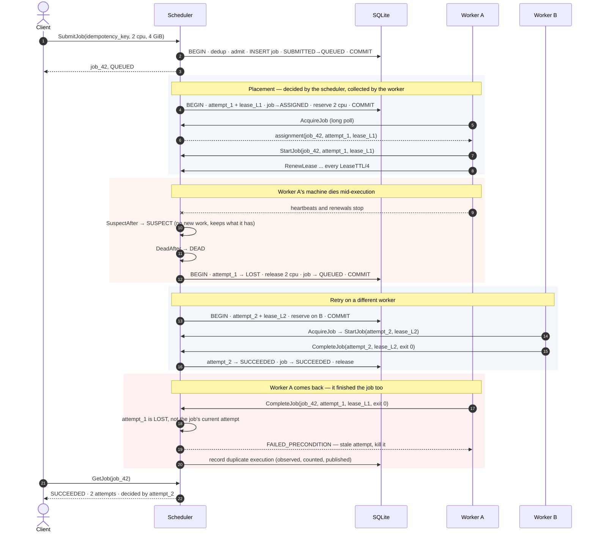
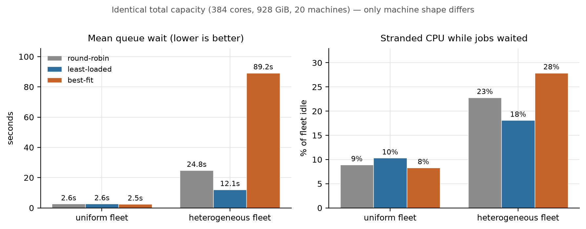
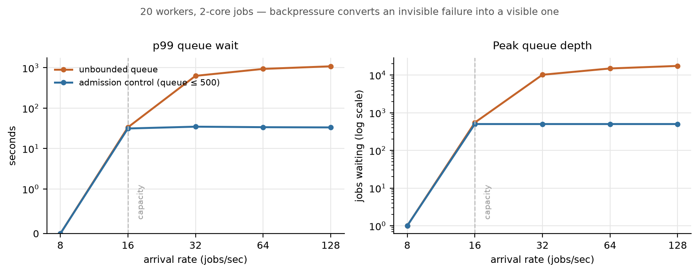
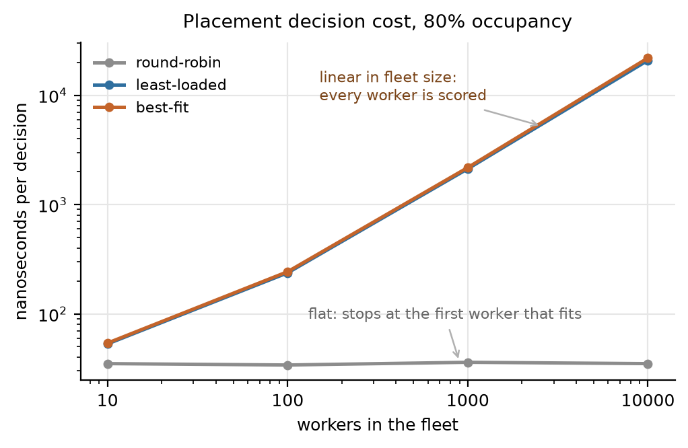

<div align="center">

# Atlas

**A fault-tolerant distributed compute scheduler in Go — resource-aware placement, attempt-scoped leases, and machine-checked correctness under randomized fault injection.**

[](https://github.com/BruceMoseti/Atlas/actions/workflows/ci.yml)
[](https://go.dev)
[](LICENSE)

[Highlights](#highlights) · [Demo](#demo) · [Architecture](#architecture) ·
[Deep dive](#technical-deep-dive) · [Results](#results) ·
[Decisions](#engineering-decisions) · [Run it](#getting-started) ·
[Design notes](PROJECT_NOTES.md)

</div>

Atlas accepts jobs with CPU and memory requirements, places them across a fleet of
worker machines, and keeps them running when the machines, processes, and network
underneath them fail.

**Why it exists.** Plenty of systems call themselves "fault tolerant" without saying
which faults, how quickly they are detected, or what recovery costs. Atlas is an
attempt at the opposite: state the guarantees precisely enough that they could be
*proven wrong*, then build the machinery that tries to prove them wrong. The
interesting constraint is one every job scheduler actually has to confront —
**a distributed system cannot tell the difference between a worker that died before
doing the work and a worker that died after doing it.**

Atlas resolves that honestly. It provides **at-least-once execution** with
attempt-scoped leases, idempotent control-plane operations, and a stale-write
rejection path — and then it *measures* the duplicate executions that result
instead of claiming there are none.

Correctness is therefore not asserted in prose. Nine invariants are stated formally
in [`docs/SEMANTICS.md`](docs/SEMANTICS.md), checked mechanically against the
database after every test run, and gated in CI under randomized `SIGKILL`,
`SIGSTOP`, scheduler restarts, and replayed RPCs.

---

## Highlights

|  | |
| --- | --- |
| **Survives 50 injected faults with zero jobs lost** | 24 worker `SIGKILL`s, 17 `SIGSTOP` freezes, 9 scheduler restarts, 20% of RPCs replayed — 3,000/3,000 jobs completed, all 9 invariants held across **24,484 audited state transitions** |
| **4.5× lower mean queue wait** from the placement policy | Least-loaded vs round-robin at 90% offered load, on an identical workload and seed; p99 wait 93s vs 5.4m |
| **Scheduler decisions in 21 µs at 10,000 workers** | ~47,000 placements/sec on one core; measured across 10 → 10,000 machines, 200,000 decisions per data point |
| **Flat queue pops at 100,000 queued jobs** | 159 ns at depth 100, 166 ns at depth 100,000 — a bucketed-deque design that a heap cannot match under priority aging |
| **Counts its own duplicate executions** | 16 observed in the flagship campaign, published rather than hidden, because that is what at-least-once honestly means |
| **Verified, not asserted** | 107 tests — 81 unit, 26 integration against real gRPC/SQLite/worker processes — plus an invariant checker with its own failure tests. All race-clean in CI. |

---

## Demo

### Submit a job

```console
$ atlas submit --cpu 1 --memory 256m --wait -- echo "hello atlas"
job_2895543ec029fe67    QUEUED
QUEUED
SUCCEEDED

job              job_2895543ec029fe67
state            SUCCEEDED
idempotency key  auto_b56d1e26233bdf38
client           cli
priority         0
request          1 cpu, 256MiB memory
command          echo hello atlas
attempts         1 of 3
exit code        0
created          204ms ago

#  ATTEMPT ID            WORKER  STATE      EXIT  FAILURE  DURATION  MESSAGE
1  att_a589ae225e8610a4  w2      SUCCEEDED  0     -        2ms

--- attempt 1 (att_a589ae225e8610a4) output ---
hello atlas
```

### Kill the machine running it — `./scripts/demo.sh`

A self-contained script: two real workers, a 30-second job, a real `SIGKILL`, and
no client involvement in the recovery. Runs in about 13 seconds. This is the actual
captured output.

```console
==> Submitting a 30-second job that occupies a whole worker
job id: job_2386f7a33135ea5b

state            RUNNING
attempts         1 of 3

#  ATTEMPT ID            WORKER  STATE    EXIT  DURATION  MESSAGE
1  att_3efdddcf8e3b7367  w2      RUNNING  -     7ms

==> Killing worker w2 with SIGKILL — no warning, no cleanup
worker w2 is gone

==> The scheduler notices, reclaims the lease, and retries elsewhere

state            RUNNING
attempts         2 of 3
failure class    WORKER_LOST
message          worker w2 declared dead after 3.049s without a heartbeat

#  ATTEMPT ID            WORKER  STATE    EXIT  DURATION  MESSAGE
1  att_3efdddcf8e3b7367  w2      LOST     -     3.038s
2  att_c8f3177f3f023aa8  w1      RUNNING  -     260ms

==> Idempotent submission: the same key returns the same job, never a second one
$ atlas submit --cpu 2 --memory 4GB --idempotency-key demo-recovery -- sleep 30
job_2386f7a33135ea5b    RUNNING    (deduplicated: idempotency key already used)
```

Attempt 1 is `LOST`, not `FAILED` — the distinction is deliberate. `FAILED` means
Atlas knows the execution finished badly; `LOST` means Atlas does not know what
happened, and the two are retried under different policies.

### Break it on purpose and check it still obeyed its own rules

```console
$ atlas-chaos --workers 10 --jobs 3000 --duration 150s --restart-scheduler \
              --duplicate-rpc-rate 0.2 --heartbeat-drop-rate 0.1

Faults injected
  kill-worker               24     # SIGKILL, no warning, no cleanup
  pause-worker              17     # SIGSTOP: alive, holding leases, answering nothing
  restart-scheduler          9     # the control plane itself

Outcome
  jobs in store           3000
  succeeded               3000
  failed after retry limit   0

Execution attempts
  attempts total          3083
  lost (lease reclaimed)    83
  duplicate executions      16     # work that really did run twice

Recovery latency          p50 64ms   p99 159ms

Invariants (docs/SEMANTICS.md §7), checked against 24484 audited state changes
  I1  terminal states were never left                      held
  I2  no worker was oversubscribed or went negative        held
  I3  allocation equals the sum of live attempts           held
  I4  at most one live attempt per job                     held
  I5  attempt counts stayed within budget                  held
  I6  every accepted job is still in the store             held
  I7  idempotency keys are unique                          held
  I8  no stale attempt decided a job's outcome             held
  I9  job and attempt states agree                         held

VERDICT: PASS - every documented invariant held under fault injection
```

The full report is committed at [`results/chaos-campaign.txt`](results/chaos-campaign.txt),
and the same campaign runs in CI on every pull request.

---

## The problem, concretely

A worker finishes a job and dies before telling the scheduler. The scheduler's
lease on that work expires. At that instant it holds exactly one fact: *it has not
received a completion.* It cannot distinguish:

- the work never happened, or
- the work happened and the acknowledgement was lost.

Any system claiming exactly-once execution here is either committing the result in
the same transaction as the side effect — impossible when the side effect is an
arbitrary user process — or is wrong.

So Atlas retries, says that it retries, and builds the machinery that makes
retrying safe:

| Property | Guarantee |
| --- | --- |
| Job submission | Idempotent, keyed by a client-supplied `idempotency_key` |
| Job execution | At-least-once, bounded by `max_attempts` |
| Control-plane state | Serializable, single SQLite writer, `synchronous=FULL` |
| Attempt authority | At most one attempt per job holds a valid lease at any instant |
| Stale results | A result from a non-current attempt can never mutate job state |
| Durability | A job acknowledged to a client survives scheduler restart |
| Completion reporting | Idempotent; a replay returns the recorded outcome |

Every execution receives `ATLAS_JOB_ID` (stable across retries) and
`ATLAS_ATTEMPT_ID` (unique per physical execution), so a workload with external
side effects has what it needs to deduplicate them itself.

---

## Architecture



Two directions in that diagram are load-bearing design decisions:

**Every connection is opened by a worker.** The scheduler never dials out. Workers
need no inbound reachability, the control plane needs no service discovery, and a
worker that cannot reach the scheduler simply loses its leases rather than entering
a half-connected state.

**The scheduler still owns placement.** Workers long-poll, but for assignments the
dispatcher already decided on and already committed. Letting workers pick their own
work would make the placement policy an emergent property of whoever polled first —
and would make the policy comparison below meaningless.

### The lease lifecycle, including the case that makes it hard

This is the whole system in one picture: a job is placed, the worker holding it
dies, the lease is reclaimed, the job is retried elsewhere — and then the original
worker comes back and reports that it had finished all along.



Step 17 is the one that matters. Worker A is telling the truth: it really did
complete the job. Accepting that report would overwrite an outcome decided by
worker B, so it is rejected (step 19) — and recorded as a duplicate execution
(step 20), because the work genuinely ran twice and pretending otherwise would be
the dishonest option.

---

## How it works

### Submitting a job

```
client ──SubmitJob(idempotency_key, cpu, memory, …)──▶ API
                                                        │
                                                 BEGIN TRANSACTION
                                                   look up idempotency_key ──▶ found? return the same job
                                                   admission checks (queue depth, client quota, could-ever-fit)
                                                   INSERT job as SUBMITTED
                                                   validate SUBMITTED → QUEUED
                                                 COMMIT + fsync
                                                        │
                                                 push to in-memory queue, wake dispatcher
                                                        ▼
client ◀────────────── job_id, QUEUED ──────────────────┘
```

Deduplication runs **before** admission control, deliberately. A client retrying a
submission it is unsure about must get the same answer it would have got the first
time, even if the queue filled up in between. Rejecting the retry would leave the
client believing the job does not exist when it does.

### Placing a job

```
dispatcher wakes (submission · completion · worker registered · 25 ms tick)
  │
  ├─ promote jobs whose retry backoff elapsed
  │
  ├─ build a batch, up to 256 placements or 2048 candidates scanned:
  │     pop the best job from the ready queue
  │     ask the policy for a worker
  │     reserve optimistically against the cached view
  │     (nothing fits? leave it queued, try the next job — the backfill window)
  │
  └─ ONE transaction for the whole batch:
        for each placement, re-read the job and worker and re-check:
          job still QUEUED?   worker still schedulable?   does it still fit?
          INSERT attempt (ASSIGNED, lease_id, expires_at)
          job QUEUED → ASSIGNED, attempt_count++
          worker.allocated += request        ← transaction FAILS if this oversubscribes
        COMMIT  (one fsync for the whole batch)
  │
  ├─ overwrite cached worker views from the committed rows
  └─ deliver assignments to each worker's mailbox
```

Batching is not a micro-optimization. Every assignment must be durable before a
worker is told about it, and durability costs one `fsync`. Committing N placements
together turns N fsyncs into one.

The re-validation inside the transaction is what makes the in-memory cache safe:
the policy chooses using a snapshot that may be stale, and the transaction decides
using rows that are not. A stale cache costs a wasted decision and nothing else.

### Executing and reporting

```
worker ──AcquireJob (long poll)──▶  committed assignments for this worker
worker ──StartJob(job, attempt, lease)──▶  attempt ASSIGNED → RUNNING
worker     …runs the workload in its own process group…
worker ──RenewLease(…)──▶  every LeaseTTL/4, extending expires_at
worker ──CompleteJob(…)──▶  attempt → SUCCEEDED, job → SUCCEEDED, capacity released
```

Every worker RPC carries `(job_id, attempt_id, lease_id)`. That is the whole
stale-write defence, explained below.

---

## Technical deep dive

<details open>
<summary><b>Leases vs heartbeats — two detectors, because they answer different questions</b></summary>

<br/>

- A **heartbeat** answers: *is this worker process alive?*
- A **lease** answers: *does this worker currently hold authority to execute this
  specific attempt?*

Those are not the same question. A worker can be alive and heartbeating while
making no progress on one job — its executor wedged, its disk full, one goroutine
deadlocked. A worker can be healthy but partitioned in exactly one direction.

```
HEALTHY ──missed 3 heartbeats──▶ SUSPECT ──sustained silence──▶ DEAD
   ▲                                │                             │
   └──────── a heartbeat ───────────┘                             ▼
                                             every attempt on it reclaimed at once

attempt assigned ──▶ renewed every LeaseTTL/4 ──▶ not renewed for LeaseTTL ──▶ LOST
```

**Two heartbeat thresholds rather than one** is the detail that matters. A single
missed heartbeat means almost nothing. `SUSPECT` stops the bleeding — the worker
receives no new work — without paying the cost of reclamation. Collapsing the two
would turn every GC pause into a round of duplicate executions.

Losing a worker is strong evidence about *all* of its attempts simultaneously, so
worker death is the fast path and lease expiry is the backstop that catches what
heartbeats cannot see.

Tested by `TestSuspectWorkerKeepsItsWork` (a worker that drops 100% of heartbeats
but keeps renewing finishes its job on the first attempt) and
`TestLeaseExpiryReclaimsAStuckWorker` (a worker that heartbeats but drops 100% of
renewals loses that one attempt and stays `HEALTHY`).

</details>

<details>
<summary><b>Stale attempt protection — the resurrected worker</b></summary>

<br/>

```
t0  worker A is assigned job J, attempt 1, lease L1
t1  A is partitioned; it keeps running the job
t2  L1 expires; attempt 1 → LOST, J requeued
t3  J is assigned to worker B as attempt 2, lease L2
t4  A's partition heals
t5  A reports "J completed successfully"
```

At `t5`, A's report **must not** become J's outcome — B may still be running and may
produce a different one.

Every worker-originated mutation carries `(job_id, attempt_id, lease_id)`, and
`validateRef` checks inside the transaction that the attempt exists, belongs to the
job, the lease id matches, and it is still the job's `current_attempt_id`. A's report
is rejected with `FAILED_PRECONDITION`.

The subtle part is distinguishing *stale* from *replayed*. An attempt in `LOST` was
reclaimed, so anything its old owner says is stale by definition. An attempt in
`SUCCEEDED`/`FAILED`/`CANCELED` reached that state through this same caller, so a
repeat is an idempotent retry after a lost response and returns the recorded
outcome. One is an error; the other must not be.

The late success is also *counted*: `atlas_duplicate_executions_detected_total`, plus
a durable marker on the attempt row so the number survives a scheduler restart.

Tested by `TestStaleAttemptCannotOverwriteCurrentResult` and
`TestForgedLeaseIsRejected`.

</details>

<details>
<summary><b>The ready queue — why buckets beat a heap under priority aging</b></summary>

<br/>

Effective priority under aging is `base + rate × wait`, which changes continuously
for every queued job. A binary heap cannot hold that: its keys mutate underneath it
and the heap property silently breaks.

The structure Atlas uses instead is a **map of per-priority deques, each sorted by
enqueue time**:

```
priority 100 ──▶ [oldest] ─ … ─ [newest]      ← head is this bucket's best job
priority  50 ──▶ [oldest] ─ … ─ [newest]
priority   0 ──▶ [oldest] ─ … ─ [newest]
                     ▲
            compare only the heads: O(distinct priorities), not O(queued jobs)
```

For FIFO, strict priority, and priority-with-aging, all three orderings are monotone
in wait time within a fixed base priority, so the best job in a bucket is always its
oldest. Comparing bucket heads therefore finds the global best in time independent
of queue depth. Earliest-deadline-first breaks that monotonicity, so it gets a real
heap.

**Measured** (`make bench`): pop cost is 159 ns at depth 100 and 166 ns at depth
100,000 for FIFO; EDF shows the expected O(log n) growth from 176 ns to 442 ns.

A separate delay heap holds jobs in retry backoff, so a job waiting out its backoff
never blocks the head of the queue.

</details>

<details>
<summary><b>Transactional resource accounting — making oversubscription unrepresentable</b></summary>

<br/>

The store exposes **transactions, not operations**:

```go
err := store.Update(ctx, func(tx *store.Tx) error {
    job, _   := tx.GetJob(jobID)
    worker, _:= tx.GetWorker(workerID)

    tx.InsertAttempt(attempt)                       // create the physical execution
    tx.TransitionJob(job, state.JobAssigned, "…")   // validated edge + audit row
    job.AttemptCount++
    tx.SaveJob(job)

    worker.Allocated = worker.Allocated.Add(job.Request)
    return tx.SaveWorker(worker)                    // REFUSES if it oversubscribes
})
```

Composing at the call site is what makes "create the attempt, move the job, reserve
the capacity" one atomic fact rather than three hopeful ones. Two rules are enforced
by the data layer rather than by convention:

1. **State only changes through `TransitionJob` / `TransitionAttempt`,** which
   validate the edge against `internal/state` and append to an audit table. Terminal
   states are absorbing *by construction*, and the audit log makes it checkable over
   a whole run rather than only at the end.
2. **`SaveWorker` rejects negative or oversubscribed allocations.** No scheduler bug
   can oversubscribe a worker; the transaction simply does not commit.

Allocation is denormalized onto the worker row so placement needs no aggregate
query. Invariant **I3** — `worker.allocated == Σ(live attempts' requests)` — is what
keeps that denormalization trustworthy, and recovery recomputes it from scratch.

</details>

<details>
<summary><b>Concurrency model and cache coherence</b></summary>

<br/>

Three things run concurrently in the scheduler:

| | |
| --- | --- |
| gRPC handlers | one goroutine per call |
| Dispatch loop | woken by a capacity-1 channel, so a burst of submissions collapses into one sweep |
| Reconcile loop | 250 ms ticker: worker health, lease expiry, queue resync |

Shared state sits behind a single mutex that is **never held across a database
transaction**. (That was a real bug: `CancelJob` and the completion path originally
refreshed a cached worker view by querying *inside* the critical section, putting
query latency in the dispatcher's path on every completion — fixed in `ebe29bc`.)
Each worker has a small mailbox lock for undelivered assignments; the lock order is
scheduler-then-mailbox and never the reverse.

The in-memory fleet and ready queue are **caches**, reconciled three ways:

| Cached state | Reconciled by |
| --- | --- |
| Worker allocation | Overwritten from committed rows after every dispatch batch, lease sweep, and completion; recomputed from scratch on recovery |
| Ready queue | Additively resynced from the `QUEUED` rows every second, so a crash between committing a requeue and pushing it in memory cannot strand a job |
| Worker health | Derived from heartbeats; recovery marks every worker `SUSPECT` and lets a heartbeat promote it |

The resync is additive only — removing entries would race with concurrent
submissions, and is unnecessary because placement re-validates every job against its
row before assigning it.

</details>

<details>
<summary><b>Crash recovery</b></summary>

<br/>

On startup the scheduler rebuilds everything from the store:

1. Mark every worker `SUSPECT` — their heartbeat age is unknown and their
   connections died with the old process. A single heartbeat promotes them back.
2. Recompute each worker's allocation from the attempts actually live on it,
   re-establishing invariant I3 by construction rather than trusting columns a crash
   may have left behind.
3. Reclaim every lease that lapsed while the process was down.
4. Rebuild the ready queue from `QUEUED` rows, **preserving `enqueued_at`** so a
   restart does not reset accrued priority — sorted oldest-first, because
   newest-first insertion made the rebuild quadratic (caught by the queue benchmark,
   fixed in `b2550e7`).

Leases are deliberately **not** extended to account for downtime. A worker that
could not renew has lost its authority: the scheduler could not observe it, so it
assumes nothing. The cost is some duplicate execution after a long outage, which is
exactly what at-least-once permits — and what the chaos campaign measures.

</details>

---

## Results

Full tables, methodology, and limitations: [`docs/RESULTS.md`](docs/RESULTS.md) and
[`docs/BENCHMARKING.md`](docs/BENCHMARKING.md). Raw output in [`results/`](results).
Reproduce with `make experiments && make chaos-campaign`.

### Fleet heterogeneity costs more than policy choice — and best-fit inverts



Two fleets with **identical total capacity** — 384 cores, 928 GiB, 20 machines —
differing only in the shape of the machines. Same workload, same arrival sequence,
same seed.

Best-fit is marginally the *best* policy on the uniform fleet (2.48 s) and **7×
worse than least-loaded** on the heterogeneous one (89.2 s vs 12.1 s). The mechanism
is specific: minimizing leftover capacity spends *scarce, specifically-shaped*
resources on jobs that did not need them. A 1-core / 12 GiB job "best-fits" onto a
32-core / 16 GiB compute node, because 16 GiB leaves less slack than the memory
node's 128 GiB would — consuming that node's scarce memory and blocking the
CPU-heavy work it exists to run.

The generalizable lesson: tight packing is only a virtue when the thing you pack
into is interchangeable.

### Admission control converts an invisible failure into a visible one



At and below capacity the two configurations are indistinguishable — backpressure
costs nothing until it is needed. Above capacity they diverge completely. Without
it, **every submission succeeds**: the caller gets a job id and a `QUEUED` state and
no indication whatsoever that anything is wrong, while p99 wait climbs to 18 minutes
and the queue reaches 17,451. With a bounded queue, p99 wait stays flat at ~33 s
across an 8× range of offered load and the excess comes back immediately as
`RESOURCE_EXHAUSTED`.

The honest cost is visible too: at 128/sec the bounded queue's CPU utilization drops
to 81%, because a 500-deep queue is sometimes too shallow to keep every worker fed
through a dip. Backpressure trades a little utilization for bounded, observable
latency.

### The O(workers) placement scan is fine to ~10,000 machines



Least-loaded and best-fit are strictly linear — 53 ns at 10 workers, 21 µs at
10,000, still ~47,000 decisions/sec on a single core. There is no case for indexing
workers by available capacity until the fleet is an order of magnitude larger, and
the simpler linear scan is worth keeping until then.

Round-robin's cost is **bimodal, not low**: flat at 35 ns whenever some worker fits,
and 25 µs when none does — making it the most expensive policy precisely when the
cluster is under pressure.

### An aging cap can silently restore the starvation it was added to prevent

| Ordering | urgent mean wait | batch mean wait |
| --- | --- | --- |
| fifo (priority ignored) | 6.4 m | 6.4 m |
| strict priority | 3.2 m | 13.6 m |
| aging 1/s, cap 1000 | 5.2 m | 9.1 m |
| aging 10/s, cap 1000 | 3.8 m | 12.3 m |
| **aging 10/s, no cap** | **6.3 m** | **6.7 m** |

Aging at 10/s *with a cap* behaves almost like strict priority; the same rate
uncapped collapses to FIFO. Once every queued job has waited long enough to saturate
the cap, both classes sit at `base + 1000` and only base priority separates them
again. The cap is not a safety rail on aging — it is the dial that decides how much
aging you actually get.

---

## Engineering decisions

<table>
<tr><th width="18%">Decision</th><th width="41%">Why</th><th width="41%">Alternative and tradeoff</th></tr>

<tr><td><b>At-least-once, not exactly-once</b></td>
<td>The scheduler genuinely cannot distinguish "never ran" from "ran, ack lost". Choosing at-least-once makes the ambiguity explicit and pushes deduplication to the only layer that can do it — the workload, which gets a stable <code>ATLAS_JOB_ID</code>.</td>
<td><i>At-most-once</i> (never retry) would be simpler and would silently drop work on every machine failure. <b>Tradeoff:</b> callers must make side effects idempotent; Atlas publishes the duplicate count so they know how often it matters.</td></tr>

<tr><td><b>Single scheduler, no Raft</b></td>
<td>Consensus is the reflex answer to "distributed scheduler" and it would make this project worse. The hard parts here are lease ownership, failure detection, resource accounting, idempotency, and <i>proving</i> the result.</td>
<td><i>Raft</i> adds a large surface of subtle bugs without improving any of those. <b>Tradeoff:</b> Atlas is crash-<i>recoverable</i>, not highly available. Stated plainly rather than papered over.</td></tr>

<tr><td><b>Workers pull; scheduler decides</b></td>
<td>Keeps every connection worker-initiated (no inbound reachability, no service discovery) while keeping placement centralized and comparable.</td>
<td><i>Scheduler pushes</i> needs routes into the fleet. <i>Workers self-select</i> makes the policy an artifact of poll order. <b>Tradeoff:</b> one long-poll round trip of dispatch latency.</td></tr>

<tr><td><b>SQLite, single writer, <code>synchronous=FULL</code></b></td>
<td>A job is acknowledged only after its row is <code>fsync</code>'d. Pinning one write connection removes <code>SQLITE_BUSY</code> from the failure model entirely.</td>
<td><i>Postgres</i> adds an operational dependency for a single-node control plane. <i>WAL + <code>synchronous=NORMAL</code></i> is faster and can lose recent commits on power loss. <b>Tradeoff:</b> one fsync per batch, which is why batching exists.</td></tr>

<tr><td><b>Batched placement commits</b></td>
<td>Durability costs an fsync; committing up to 256 placements together turns N fsyncs into one.</td>
<td><i>One transaction per placement</i> is simpler and caps throughput at the disk's fsync rate. <b>Tradeoff:</b> partial-batch failures need explicit handling, so each item is re-validated inside the transaction.</td></tr>

<tr><td><b>Bucketed deques, not a heap</b></td>
<td>Priority aging mutates every key continuously, which a heap cannot tolerate. Monotonicity within a bucket makes head-comparison exact.</td>
<td><i>Heap with periodic rebuild</i> is O(n log n) per rebuild and approximate between them. <b>Tradeoff:</b> EDF breaks the monotonicity assumption and needs a separate heap.</td></tr>

<tr><td><b>Denormalized allocation + invariant I3</b></td>
<td>Placement must not run an aggregate query per decision. The denormalized column is fast; I3 is what makes it trustworthy, and recovery recomputes it.</td>
<td><i>Derive from live attempts every time</i> is always correct and too slow for the hot path. <b>Tradeoff:</b> a second source of truth, which is why it is checked mechanically rather than assumed.</td></tr>

<tr><td><b><code>PROCESS_EXIT</code> not retried by default</b></td>
<td>A deterministic program that exits 1 will exit 1 again. Retrying burns cluster capacity to produce the same answer.</td>
<td><i>Retry everything</i> hides nothing and wastes capacity. <b>Tradeoff:</b> genuinely flaky workloads must opt in via <code>--retry-on-process-exit</code>.</td></tr>
</table>

---

## Engineering concepts, and where they live in the code

A map for anyone who wants to check a specific claim rather than take the prose on
trust.

| Concept | Where | Specifically |
| --- | --- | --- |
| **Failure detection** | `scheduler/lease.go` | Two-stage heartbeat ageing (`HEALTHY → SUSPECT → DEAD`) with separate thresholds, plus independent lease expiry for faults heartbeats cannot observe |
| **Leases / fencing tokens** | `scheduler/worker_api.go` | Attempt-scoped authority; `validateRef` rejects any mutation from a caller that no longer owns the attempt — the same reasoning as a fencing token on a distributed lock |
| **At-least-once semantics** | `docs/SEMANTICS.md` | The guarantee stated formally, the reason exactly-once is impossible here, and the duplicate count published rather than hidden |
| **Idempotency** | `scheduler/jobs.go`, `worker_api.go` | Submission keyed on a client token with a spec hash to catch key reuse; every worker RPC safely replayable after a lost response |
| **ACID transactions & durability** | `store/store.go` | `Update(func(*Tx) error)` composes multi-row writes atomically; WAL + `synchronous=FULL`; a job is acknowledged only after `fsync` |
| **Invariant specification & checking** | `internal/invariants` | Nine properties stated formally and verified mechanically against the durable record — including an append-only audit log, so "terminal states are absorbing" is checked over the whole history |
| **Concurrency & lock discipline** | `scheduler/scheduler.go`, `dispatch.go` | One mutex never held across I/O, documented lock ordering, a capacity-1 wakeup channel that collapses event bursts into one sweep; race-detector clean including integration tests |
| **Optimistic concurrency** | `scheduler/dispatch.go` | Placement decided against a cached fleet view, then re-validated inside the transaction — the cache can be wrong without ever being dangerous |
| **Data structures** | `scheduler/queue.go` | Per-priority deques giving O(distinct priorities) pop under continuously-changing keys, a binary heap for EDF where monotonicity fails, a separate delay heap for retry backoff |
| **Algorithmic complexity, measured** | `scheduler/bench_test.go` | Pop cost flat from depth 100 to 100,000; placement cost linear in fleet size and quantified, which is the argument for *not* optimizing it |
| **Discrete-event simulation** | `simulator/` | Virtual-clock event loop over a priority queue of events, driving the real scheduler components at fleet sizes a single machine cannot run |
| **Probability & queueing** | `simulator/workload.go` | Poisson arrivals (exponential interarrival times), heavy-tailed bimodal service times, offered load normalized against a computed sustainable throughput bound |
| **Tail-latency analysis** | `simulator/simulator.go` | p50/p95/p99/max wait and turnaround, time-weighted utilization integrals, and a fragmentation metric normalized against time-under-demand |
| **Backpressure & flow control** | `scheduler/admission.go` | Bounded queue, per-client quotas, and rejection of jobs no machine could ever run — with the measured cost of omitting it |
| **Exponential backoff with jitter** | `scheduler/lease.go` | Full jitter (`rand(0, min(base·2ⁿ, max))`), because the failure that caused the retry usually hit many jobs at once |
| **RPC & schema design** | `proto/atlas.proto` | Two services split by audience; domain errors mapped to gRPC codes that tell a caller what to *do*; long-poll assignment delivery |
| **Process & resource isolation** | `worker/executor.go` | Linux process groups so a killed job takes its children with it; Docker executor with kernel-enforced CPU and memory limits |
| **Observability** | `internal/metrics`, `api/health.go` | 20 Prometheus metrics, liveness separated from readiness, structured event logs carrying job/attempt/worker/lease ids, alert rules mapped to the failure model |
| **Crash recovery** | `scheduler/scheduler.go` | State rebuilt from the store, allocation recomputed from live attempts, lapsed leases reclaimed, accrued priority preserved across the restart |

---

## Tech stack

| | |
| --- | --- |
| **Language** | Go 1.22 — goroutines and channels for the dispatch/reconcile loops, `log/slog` for structured events, `math/rand/v2` for jittered backoff |
| **RPC & schema** | gRPC, Protocol Buffers (two services: client-facing and worker-facing), gRPC health checking protocol, server reflection |
| **Storage** | SQLite via `modernc.org/sqlite` (pure Go, so `CGO_ENABLED=0` cross-compiles and the container needs no libsqlite); WAL, `synchronous=FULL`, single pinned writer + read pool |
| **Observability** | Prometheus (`client_golang`) — 20 metrics; logfmt/JSON structured logs; `/live` + `/ready` split; alerting rules in [`deployments/alerts.yml`](deployments/alerts.yml) |
| **Execution** | Linux process groups (`Setpgid`) so a killed job takes its children with it; Docker CLI executor with kernel-enforced `--cpus` / `--memory` |
| **Testing** | Go test + race detector, build-tagged integration suite, custom invariant checker, discrete-event simulator, process-level chaos harness |
| **CI/CD** | GitHub Actions — lint, `staticcheck`, race-detector unit tests, integration tests, a chaos campaign as a correctness gate, proto-drift check, 3-platform cross-compile |
| **Deployment** | Multi-stage Dockerfile (Go builder → Alpine), Docker Compose with a deliberately heterogeneous fleet + Prometheus |

---

## Repository structure

```
cmd/                       entry points
├── atlas-server/          control plane: gRPC API + scheduler + HTTP observability
├── atlas-worker/          execution agent: register, heartbeat, acquire, renew, run
├── atlas-cli/             client: submit, get, list, cancel, workers, drain, status
├── atlas-chaos/           fault-injection campaign runner (exits non-zero on violation)
└── atlas-sim/             discrete-event scheduling experiments

internal/
├── state/                 job/attempt/worker state machines — the ONLY legal transitions
├── types/                 domain objects + resource arithmetic (no behaviour, no cycles)
├── store/                 SQLite: exposes transactions, validates edges, refuses
│                          oversubscription, maintains the append-only audit log
├── scheduler/             placement, leases, retries, admission, recovery
│   ├── policies.go        round-robin · least-loaded · best-fit
│   ├── queue.go           bucketed deques + EDF heap + retry-backoff delay heap
│   ├── dispatch.go        batched, re-validated, durable placement
│   ├── lease.go           lease expiry, worker health ageing, retry disposition
│   ├── worker_api.go      the worker protocol + stale-attempt rejection
│   └── admission.go       backpressure limits
├── worker/                agent + process and Docker executors
├── invariants/            mechanical checker for the nine documented invariants
├── api/                   gRPC wire layer (the only place protobuf meets the domain)
├── metrics/ logging/      Prometheus collectors, structured event logging

proto/atlas.proto          service + message definitions (generated code committed)
simulator/                 discrete-event model reusing the real queue and policies
chaos/                     campaign orchestration + invariant report
tests/                     integration suite (build tag: integration)

scripts/
├── demo.sh                scripted worker-kill recovery against real processes
└── plot_results.py        regenerates docs/images/ by parsing results/*.txt

deployments/               Dockerfile, docker-compose, Prometheus config + alert rules
docs/                      SEMANTICS · ARCHITECTURE · FAILURE_MODEL · BENCHMARKING · RESULTS
results/                   committed raw output from the experiments the docs cite
.github/workflows/ci.yml   lint · race tests · integration · chaos gate · proto drift
```

`internal/scheduler` does not import protobuf — which is why the simulator can drive
the real queue and policies directly, and why the unit tests need no network.

---

## Getting started

**Prerequisites:** Go 1.22+. That is all — the SQLite driver is pure Go, so there is
no cgo toolchain, no system SQLite, and no database server to install.
(`protoc` is only needed if you change `proto/atlas.proto`; Docker only for the
container executor or Compose.)

```bash
git clone https://github.com/BruceMoseti/Atlas.git
cd Atlas
make build          # ./bin/{atlas-server,atlas-worker,atlas,atlas-chaos,atlas-sim}
make help           # every target, with a one-line description
```

### Fastest way to see it work — about 13 seconds

```bash
make demo           # starts two workers, SIGKILLs the one running a job,
                    # shows the job finish on the other one
```

### Run a local cluster yourself

```bash
# Control plane
./bin/atlas-server --db atlas.db --listen :50051 --http :9090

# A deliberately heterogeneous fleet, in another shell
./bin/atlas-worker --scheduler localhost:50051 --id w1 --cpu 8  --memory 16GB &
./bin/atlas-worker --scheduler localhost:50051 --id w2 --cpu 4  --memory 8GB  &
./bin/atlas-worker --scheduler localhost:50051 --id w3 --cpu 16 --memory 64GB &

# Client
./bin/atlas submit --cpu 1 --memory 256m --wait -- echo "hello atlas"
./bin/atlas workers
./bin/atlas status
```

Or bring the whole thing up, Prometheus included:

```bash
docker compose -f deployments/docker-compose.yml up --build
```

### Observability

```bash
curl localhost:9090/live      # is the process running?
curl localhost:9090/ready     # can it safely accept work? (fails if the DB does not answer)
curl localhost:9090/status    # utilization, queue depth, active policy
curl localhost:9090/metrics   # Prometheus
```

---

## Usage

```bash
# Submit, with an idempotency key — resubmitting returns the SAME job id
atlas submit --idempotency-key nightly-2026-10-01 \
             --cpu 2 --memory 4GB --priority 50 --timeout 10m \
             --max-attempts 5 --retry-on-process-exit \
             -- python train.py --epochs 10

# Container workloads (worker must run with --executor=docker)
atlas submit --image python:3.12-slim --cpu 2 --memory 1GB -- python -c "print(1+1)"

# Inspect: full attempt history, which worker ran what, why anything failed
atlas get job_1a2b3c4d
atlas list --state RUNNING,QUEUED --limit 20

# Operations
atlas cancel job_1a2b3c4d --reason "superseded"
atlas drain w2              # no new work; running jobs finish
atlas drain w2 --undo
```

Clients talk gRPC, so any language works. The service is reflection-enabled:

```bash
grpcurl -plaintext localhost:50051 list atlas.v1.AtlasService
grpcurl -plaintext -d '{"job_id":"job_1a2b3c4d","include_attempts":true}' \
        localhost:50051 atlas.v1.AtlasService/GetJob
```

---

## Testing

The test strategy maps to what each layer can actually prove.

| Layer | Tests | Command | What it establishes |
| --- | --- | --- | --- |
| Unit — core packages | 68 | `make test` | Every state-machine edge exhaustively; queue orderings and aging; fit and each policy; backoff bounds and jitter; store transactionality and rollback; executor exit-code classification and process-group kill |
| ├ of which, invariant checker | 11 | `go test ./internal/invariants/...` | Each invariant, against a database constructed to violate exactly that one |
| Unit — simulator model | 11 | `go test ./simulator/...` | Determinism under a seed, job conservation, no oversubscription in the model, failure path wired up |
| Unit — CLI argument handling | 2 | `go test ./cmd/...` | Flag reordering, so `atlas cancel JOB --reason x` cannot silently drop the reason |
| **Integration** | **26** | `make test-integration` | Real gRPC over TCP, real SQLite on disk, real worker processes running real commands — then killed |
| Chaos | — | `make chaos` | Randomized `SIGKILL`/`SIGSTOP`/restarts against real processes; exits non-zero on any invariant violation |
| Benchmarks | 3 | `make bench` | Placement decision cost and queue operations |

**107 tests total**, all race-clean in CI.

```bash
make test-race          # everything above, race detector clean (~25s)
make test-integration   # real processes (~42s with -race)
make chaos              # short fault-injection campaign (~60s)
```

Two things worth calling out:

**The invariant checker has its own failure tests.** `internal/invariants` builds
databases containing each specific violation — a resurrected terminal state, an
oversubscribed worker, two live attempts on one job — and asserts the checker names
it. A checker that has only ever seen valid states is not evidence that it would
catch an invalid one.

**The simulator is tested too.** Determinism under a seed, job conservation, no
oversubscription inside the model, and that the failure path is actually wired up.
A simulator with a bug produces convincing wrong numbers, which is worse than
producing none.

### Edge cases covered

Lost `StartJob` followed by a fast completion · forged lease ids · duplicate
completion after a lost response · a worker re-registering with the same id ·
cancellation of a job mid-execution · a job larger than any machine · corrupted
allocation columns at startup · scheduler restart with and without a surviving
fleet · a worker that heartbeats but never renews · a worker that renews but never
heartbeats.

---

## Future improvements

Ordered by what would materially strengthen the system, not by effort.

1. **Verify the Docker executor against a live daemon.** It is implemented and
   documented but has never actually run — the development environment had no
   Docker. Until it does, only the process executor is evidence of anything.
2. **Leader election over a replicated log for HA.** Not Raft-from-scratch: an
   embedded consensus library holding only the leadership lease, with the existing
   SQLite store replicated by log shipping. Atlas today is crash-recoverable but not
   available during a restart, and the restart window is the only unbounded outage
   in the failure model.
3. **Replace the per-sweep linear fleet scan with capacity-bucketed indexing** once
   fleets exceed ~10,000 workers. Benchmarks show the scan costs 21 µs at 10k, so
   this is explicitly *not* worth doing yet — the measurement is the justification
   for leaving it alone.
4. **Gang scheduling for jobs that need N workers simultaneously.** Requires
   all-or-nothing placement across multiple workers in one transaction, which the
   batched-commit path already structurally supports but the queue does not model.
5. **Oversubscription with preemption.** Allow allocation beyond 100% for jobs
   marked best-effort, and preempt them when a guaranteed job needs the capacity.
   Needs a priority-aware eviction policy and a `PREEMPTED` failure class that is
   retryable without counting against the attempt budget.
6. **Replace the long-poll mailbox with a server-streaming RPC.** Long polling costs
   a round trip per dispatch; a stream would cut assignment latency and let the
   scheduler push cancellations immediately instead of waiting for the next
   heartbeat.
7. **mTLS and per-client authentication.** `client_id` is a quota bucket, not an
   identity. Atlas currently assumes a trusted network.

---

## Limitations

Stated here rather than discovered later.

- **Not highly available.** One scheduler process, no consensus, no replication. If
  it dies the control plane is unavailable until it restarts; running jobs keep
  running and are reconciled afterwards. Atlas is crash-*recoverable*, not
  fault-*tolerant to scheduler loss*. It does not survive loss of its disk.
- **The Docker executor is unverified.** Implemented and documented; never run
  against a live daemon.
- **No authentication, authorization, or TLS.** Trusted-network assumption.
- **No job dependencies, DAGs, autoscaling, or GPU support.**
- **Duplicate-execution counts are a lower bound.** Atlas counts the duplicates it
  observes — a reclaimed worker reporting success afterwards. A worker that dies
  mid-job without reporting leaves no evidence either way, and nothing can recover
  it later.
- **Benchmarks are single-machine, single-run.** The differences highlighted above
  are factors rather than percentages, so noise does not explain them; small
  differences in the full tables should not be read as real.

---

## Documentation

| | |
| --- | --- |
| [`docs/SEMANTICS.md`](docs/SEMANTICS.md) | **Normative.** Written before the scheduler. Execution guarantees, both state machines, the lease model, stale-attempt protection, idempotency, retry classification, and the nine invariants. |
| [`docs/ARCHITECTURE.md`](docs/ARCHITECTURE.md) | Request flow, package boundaries, concurrency model, cache reconciliation, and an explicit "what Atlas is not". |
| [`docs/FAILURE_MODEL.md`](docs/FAILURE_MODEL.md) | Every fault handled, its detection bound, its response, and the test covering it — plus the faults that are *not* handled. |
| [`docs/BENCHMARKING.md`](docs/BENCHMARKING.md) | What each measurement tool can and cannot claim, precise metric definitions, eight named limitations. |
| [`docs/RESULTS.md`](docs/RESULTS.md) | Every measured number, including the unflattering ones. |
| [`PROJECT_NOTES.md`](PROJECT_NOTES.md) | Design rationale, the hardest problems, bugs found and how, and interview-style Q&A. |

---

<div align="center">
<sub>MIT licensed · built as a focused study of distributed systems failure handling</sub>
</div>
